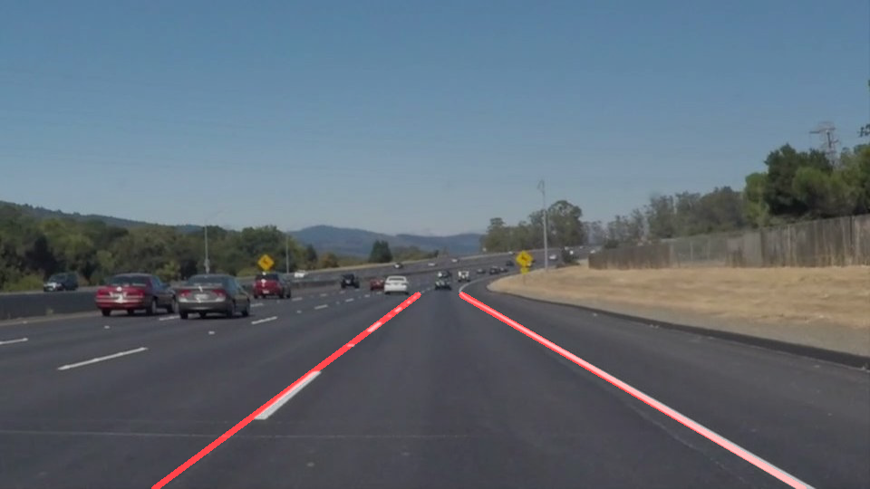
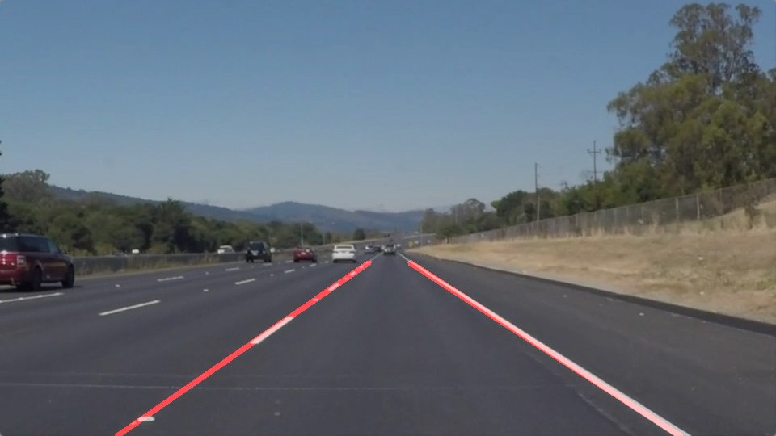
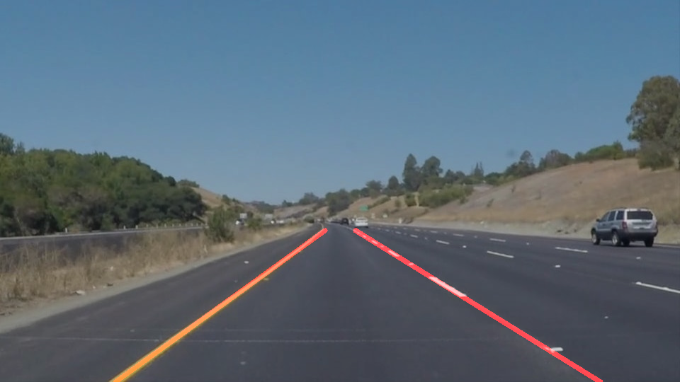
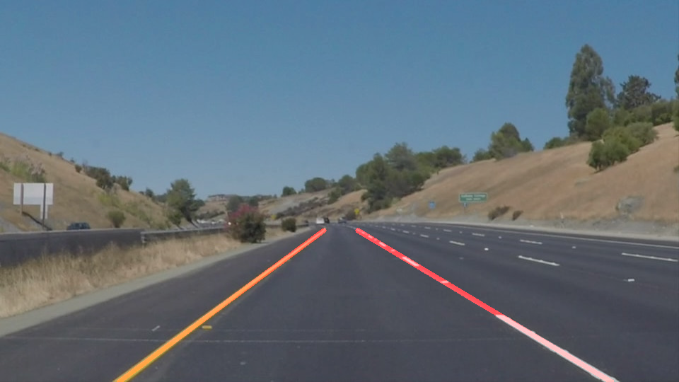
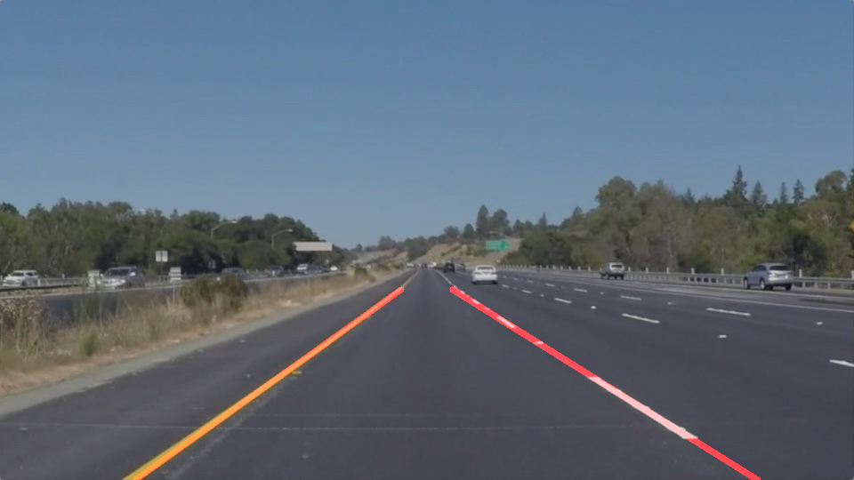
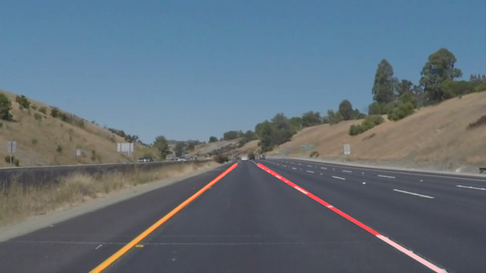

# **Finding Lane Lines on the Road** 
---
This is the first project in Udacity's Self Driving Car Nanodegree Program. 

The aim of this project is to detect road lane lines captured by camera mounted on a car dashboard. 
  
This project involves 
*  lane detection using color selection,   
*  region of interest selection,   
*  grayscaling,   
*  Gaussian smoothing,   
*  Canny Edge Detection and  
*  Hough Tranform line detection. 

The static image output should look like the following:

<table>
<tr>
    <td>
        
    </td>
    <td>
        
    </td>
</tr>
<tr>
    <td align="center">
        Image on lane detection
    </td>
    <td align="center">
        Image on connect/average/extrapolate lane segements
    </td>
</tr>
</table>


```python
# Import useful packages

import matplotlib.pyplot as plt
import matplotlib.image as mpimg
import numpy as np
import cv2
import os
from moviepy.editor import VideoFileClip
from IPython.display import HTML
%matplotlib inline
```


```python
# Helper functions
import math

def grayscale(img):
    """Applies the Grayscale transform
    This will return an image with only one color channel
    but NOTE: to see the returned image as grayscale
    you should call plt.imshow(gray, cmap='gray')"""
    return cv2.cvtColor(img, cv2.COLOR_BGR2GRAY)
    
def canny(img, low_threshold, high_threshold):
    """Applies the Canny transform"""
    return cv2.Canny(img, low_threshold, high_threshold)

def gaussian_blur(img, kernel_size):
    """Applies a Gaussian Noise kernel"""
    return cv2.GaussianBlur(img, (kernel_size, kernel_size), 0)

def region_of_interest(img, vertices):
    """
    Applies an image mask.
    
    Only keeps the region of the image defined by the polygon
    formed from `vertices`. The rest of the image is set to black.
    """
    #defining a blank mask to start with
    mask = np.zeros_like(img)   
    
    #defining a 3 channel or 1 channel color to fill the mask with depending on the input image
    if len(img.shape) > 2:
        channel_count = img.shape[2]  # i.e. 3 or 4 depending on your image
        ignore_mask_color = (255,) * channel_count
    else:
        ignore_mask_color = 255
        
    #filling pixels inside the polygon defined by "vertices" with the fill color    
    cv2.fillPoly(mask, vertices, ignore_mask_color)
    
    #returning the image only where mask pixels are nonzero
    masked_image = cv2.bitwise_and(img, mask)
    return masked_image


def draw_lines(img, lines, color=[255, 0, 0], thickness=2):
    """
    NOTE: this is the function you might want to use as a starting point once you want to 
    average/extrapolate the line segments you detect to map out the full
    extent of the lane (going from the result shown in raw-lines-example.mp4
    to that shown in P1_example.mp4).  
    
    Think about things like separating line segments by their 
    slope ((y2-y1)/(x2-x1)) to decide which segments are part of the left
    line vs. the right line.  Then, you can average the position of each of 
    the lines and extrapolate to the top and bottom of the lane.
    
    This function draws `lines` with `color` and `thickness`.    
    Lines are drawn on the image inplace (mutates the image).
    If you want to make the lines semi-transparent, think about combining
    this function with the weighted_img() function below
    """
    for line in lines:
        for x1,y1,x2,y2 in line:
            cv2.line(img, (x1, y1), (x2, y2), color, thickness)

def hough_lines(img, rho, theta, threshold, min_line_len, max_line_gap):
    """
    `img` should be the output of a Canny transform.
        
    Returns an image with hough lines drawn.
    """
    lines = cv2.HoughLinesP(img, rho, theta, threshold, np.array([]), minLineLength=min_line_len, maxLineGap=max_line_gap)
    line_img = np.zeros((*img.shape, 3), dtype=np.uint8)
    draw_lines(line_img, lines)
    return line_img

# Python 3 has support for cool math symbols.

def weighted_img(img, initial_img, α=0.8, β=1., λ=0.):
    """
    `img` is the output of the hough_lines(), An image with lines drawn on it.
    Should be a blank image (all black) with lines drawn on it.
    
    `initial_img` should be the image before any processing.
    
    The result image is computed as follows:
    
    initial_img * α + img * β + λ
    NOTE: initial_img and img must be the same shape!
    """
    return cv2.addWeighted(initial_img, α, img, β, λ)
```


```python
# Detect left and right lane 

def detect_lanes_average_extrapolate(lines):
    """
    `lines` are the list of Hough lines.
        
    Returns List of end points and slope for left and right lane.
    """
    # Initialization
    left_lane = []
    right_lane = []    

    for line in lines:
        for xi,yi,xj,yj in line:
            slope = 1.0*(yj-yi)/(xj-xi)
            
            if(slope > slope_threshold_lower and slope < slope_threshold_higher):
                left_lane.append([xi, yi, xj, yj, slope])
            elif(slope < -slope_threshold_lower and slope > -slope_threshold_higher):
                right_lane.append([xi, yi, xj, yj, slope])

    # Calculate average of x1, x2, y1, y2, slope
    mean_left_lane = np.mean(left_lane, axis = 0)
    mean_right_lane = np.mean(right_lane, axis = 0)
    
    # Calculate average x and y for left and right lanes
    mean_left_point = [np.mean([mean_left_lane[0], mean_left_lane[2]]), \
                                np.mean([mean_left_lane[1], mean_left_lane[3]])]
                                        
    mean_right_point = [np.mean([mean_right_lane[0], mean_right_lane[2]]), \
                                np.mean([mean_right_lane[1], mean_right_lane[3]])]
                                       
    # Calculate intercept: c = y - m*x
    left_line_intercept = mean_left_point[1] - mean_left_lane[4]*mean_left_point[0]  
    right_line_intercept = mean_right_point[1] - mean_right_lane[4]*mean_right_point[0]  

    # Calculate end points of lanes                            
    left_lane_SW_point = [ np.round((y1-left_line_intercept)/mean_left_lane[4]), y1]
    left_lane_NW_point = [ np.round((y2-left_line_intercept)/mean_left_lane[4]), y2]

    right_lane_SE_point = [ np.round((y1-right_line_intercept)/mean_right_lane[4]), y1]
    right_lane_NE_point = [ np.round((y2-right_line_intercept)/mean_right_lane[4]), y2]

    # List of end points and slope for left and right lane: 
        # xl1, yl1, xl2, yl2, slopel, xr1, yr1, xr2, yr2, sloper
    detected_lane_endpoints_slope = [int(round(left_lane_SW_point[0])), \
                                     int(round(left_lane_SW_point[1])), \
                                     int(round(left_lane_NW_point[0])), \
                                     int(round(left_lane_NW_point[1])), \
                                     mean_left_lane[4] ,\
                                     int(round(right_lane_SE_point[0])), \
                                     int(round(right_lane_SE_point[1])), \
                                     int(round(right_lane_NE_point[0])), \
                                     int(round(right_lane_NE_point[1])), \
                                     mean_right_lane[4] ]

    return detected_lane_endpoints_slope   
```


```python
# Draw lanes on image

def drawlanes(image, lane, color=[255, 0, 0], thickness=4):
    """
    `image` is the original image.
    `lane` is the list of end points and slope for left and right lane
        
    Returns image with lanes.
    """
    # Initialization
    line_img = np.zeros((*image.shape, 3), dtype=np.uint8)

    lx1,ly1,lx2,ly2,lslope,rx1,ry1,rx2,ry2,rslope = lane
    cv2.line(line_img, (lx1, ly1), (lx2, ly2), color, thickness)
    cv2.line(line_img, (rx1, ry1), (rx2, ry2), color, thickness)
            
    return line_img
```


```python
# Lane detection pipeline 

def lanedetection_pipeline(image):
    """
    `image` is the original image
        
    Returns detected lanes image and list of end points and slope for left and right lane.
    """        
    gray = grayscale(image)
    blur_gray = gaussian_blur(gray, kernel_size)
    cannyedges = canny(blur_gray, low_threshold, high_threshold)
    masked_edges = region_of_interest(cannyedges, vertices)
    houghlines, lines = hough_lines(masked_edges, rho, theta, threshold, min_line_len, max_line_gap)
    lane = detect_lanes_average_extrapolate(lines) 
    detected_lanes = drawlanes(masked_edges, lane, color=[255, 0, 0], thickness=6) 
    
    return detected_lanes, lane     
```


```python
# Constants Deceleration   

kernel_size = 5        # Gaussian blur kernel size
low_threshold = 50     # Canny Edge detection parameter
high_threshold = 150   # Canny Edge detection parameter

#### Define masking polygon
image = mpimg.imread('test_images/solidWhiteRight.jpg')
imshape = image.shape

# Points defining polygon mask
x1, y1 = 120, imshape[0]
x4, y4 = 920, y1
x2, y2 = 435, 325
x3, y3 = ((x1+x4) - x2)- 50, y2
vertices = np.array([[(x1,y1),(x2, y2), (x3, y3), (x4,y4)]], dtype=np.int32)

# Define the Hough transform parameters
rho = 1 # distance resolution in pixels of the Hough grid
theta = np.pi/180 # angular resolution in radians of the Hough grid
threshold = 20  #20   # minimum number of votes (intersections in Hough grid cell)
min_line_len = 50 # 50 #minimum number of pixels making up a line
max_line_gap = 30    # maximum gap in pixels between connectable line segments

# Define slope threshold to detect only the lanes
slope_threshold_lower = 0.46 # to select only lanes 
slope_threshold_higher = 0.83 # higher angle of lanes

# smoothing parameter for lanes across video frames
alpha = 0.5
```

## Test on Images

The code is first tested on sample images. The results are saved in the test images.


```python
imagelist = ["test_images/"+imgname for imgname in os.listdir("test_images/")]

for image in imagelist:

    image_original = mpimg.imread(image)
    img = (np.copy(image_original)*255).astype('uint8')
    
    detected_lanes, _ = lanedetection_pipeline(img)
    road_with_lane_edges = weighted_img(detected_lanes, mpimg.imread(image), α=0.8, β=1., λ=0.)
    
    mpimg.imsave("test_images/"+image.replace("test_images/","")+"-after.png", road_with_lane_edges)
```


    ---------------------------------------------------------------------------

    ValueError                                Traceback (most recent call last)

    <ipython-input-29-1f18539c1adf> in <module>()
          6     img = (np.copy(image_original)*255).astype('uint8')
          7 
    ----> 8     detected_lanes, _ = lanedetection_pipeline(img)
          9     road_with_lane_edges = weighted_img(detected_lanes, mpimg.imread(image), α=0.8, β=1., λ=0.)
         10 


    <ipython-input-18-bfe1a09846f3> in lanedetection_pipeline(image)
         11     cannyedges = canny(blur_gray, low_threshold, high_threshold)
         12     masked_edges = region_of_interest(cannyedges, vertices)
    ---> 13     houghlines, lines = hough_lines(masked_edges, rho, theta, threshold, min_line_len, max_line_gap)
         14     lane = detect_lanes_average_extrapolate(lines)
         15     detected_lanes = drawlanes(masked_edges, lane, color=[255, 0, 0], thickness=6)


    ValueError: too many values to unpack (expected 2)


<table>
<tr>
    <td>
        
    </td>
    <td>
        
    </td>
</tr>
<tr>
    <td>
        
    </td>
    <td>
        
    </td>
</tr>
<tr>
    <td>
        
    </td>
    <td>
        
    </td>
</tr>
<tr>
    <td>
        
    </td>
    <td>
        
    </td>
</tr>
<tr>
    <td>
        
    </td>
    <td>
        
    </td>
</tr>
<tr>
    <td>
        
    </td>
    <td>
        
    </td>
</tr>
<tr>
    <td>
        
    </td>
    <td>
        
    </td>
</tr>
<tr>
    <td align="center">
        Original image
    </td>
    <td align="center">
        Image with detected lanes
    </td>
</tr>
</table>

---

## Test on Videos

Now let's extend the image pipeline to videos.


```python
# Video Analysis

def process_image(image):
    """
    `image` is an handle to image 
    """     
    
    global cache_lane
    img = (np.copy(image)*255).astype('uint8')
    line_img = np.zeros([image.shape[0], image.shape[1]], dtype=np.uint8)
   
    _, predicted_lane = lanedetection_pipeline(img)
    
    smooth_lane_0 = alpha* np.asarray(predicted_lane) + (1-alpha)* np.asarray(cache_lane) 
    
    smooth_lane = [int(round(smooth_lane_0[0])), int(round(smooth_lane_0[1])), \
                int(round(smooth_lane_0[2])), int(round(smooth_lane_0[3])), smooth_lane_0[4] ,\
                int(round(smooth_lane_0[5])), int(round(smooth_lane_0[6])), \
                int(round(smooth_lane_0[7])), int(round(smooth_lane_0[8])), smooth_lane_0[9] ]
    
    detected_lanes = drawlanes(line_img, smooth_lane,color=[255, 0, 0], thickness=4)
    road_with_lane_edges = weighted_img(detected_lanes, image, α=0.8, β=1., λ=0.)
    cache_lane = smooth_lane
    
    return road_with_lane_edges
```


```python
# Cache_lane initialization for lane smoothing in videos

def cache_lane_initialization(clip):
    """
    `clip` is an handle to video clip 
    """ 
    global cache_lane
    
    cache_lane = [] 
    frame_t0 = clip.get_frame(t=0)
    img = (np.copy(frame_t0)*255).astype('uint8')
    _, cache_lane = lanedetection_pipeline(img)
    
    return cache_lane  
```

**Example 1: **
Video with solid white lane on the right first.


```python
clip1 = VideoFileClip("solidWhiteRight.mp4") # Input
white_output = 'white.mp4' # Output

cache_lane = cache_lane_initialization(clip1)
white_clip = clip1.fl_image(process_image) 
%time white_clip.write_videofile(white_output, audio=False)
```


    ---------------------------------------------------------------------------

    ValueError                                Traceback (most recent call last)

    <ipython-input-32-8c1a62510c82> in <module>()
          2 clip1 = VideoFileClip("solidWhiteRight.mp4")
          3 
    ----> 4 cache_lane = cache_lane_initialization(clip1)
          5 white_clip = clip1.fl_image(process_image)
          6 get_ipython().magic('time white_clip.write_videofile(white_output, audio=False)')


    <ipython-input-31-52efbbeeafc3> in cache_lane_initialization(clip)
         10     frame_t0 = clip.get_frame(t=0)
         11     img = (np.copy(frame_t0)*255).astype('uint8')
    ---> 12     _, cache_lane = lanedetection_pipeline(img)
         13 
         14     return cache_lane


    <ipython-input-18-bfe1a09846f3> in lanedetection_pipeline(image)
         11     cannyedges = canny(blur_gray, low_threshold, high_threshold)
         12     masked_edges = region_of_interest(cannyedges, vertices)
    ---> 13     houghlines, lines = hough_lines(masked_edges, rho, theta, threshold, min_line_len, max_line_gap)
         14     lane = detect_lanes_average_extrapolate(lines)
         15     detected_lanes = drawlanes(masked_edges, lane, color=[255, 0, 0], thickness=6)


    ValueError: too many values to unpack (expected 2)


<video width="800" height="450" controls>
  <source src="white.mp4" type="video/mp4">
</video>

**Example 2: **
Video with solid yellow lane on the left.


```python
clip2 = VideoFileClip('solidYellowLeft.mp4') # Input
yellow_output = 'yellow.mp4' # Output

cache_lane = cache_lane_initialization(clip2)
yellow_clip = clip2.fl_image(process_image)
%time yellow_clip.write_videofile(yellow_output, audio=False)
```

<video width="800" height="450" controls>
  <source src="yellow.mp4" type="video/mp4">
</video>

## Reflections

The project was particularly challanging for 
Congratulations on finding the lane lines!  As the final step in this project, we would like you to share your thoughts on your lane finding pipeline... specifically, how could you imagine making your algorithm better / more robust?  Where will your current algorithm be likely to fail?

Please add your thoughts below,  and if you're up for making your pipeline more robust, be sure to scroll down and check out the optional challenge video below!


## Optional Challenge

Try your lane finding pipeline on the video below.  Does it still work?  Can you figure out a way to make it more robust?  If you're up for the challenge, modify your pipeline so it works with this video and submit it along with the rest of your project!


```python
clip3 = VideoFileClip('challenge.mp4') # Input
challenge_output = 'extra.mp4' # Output

challenge_clip = clip3.fl_image(process_image)
%time challenge_clip.write_videofile(challenge_output, audio=False)
```

<video width="800" height="450" controls>
  <source src="extra.mp4" type="video/mp4">
</video>
