# Self-Driving Car Engineer Nanodegree

# Advanced Lane Finding
- - -
[TOC]

## 1. Project Overview

The objective of this project is to create a image/video processing pipeline to detect road lanes under different enviornmental conditions using image processing techniques. 


## 2. Camera Calibration and Distortion Correction

<table>
<tr>
    <td style="text-align: center;">
        **Original Image**
    </td>
    <td style="text-align: center;">
        **Distortion Correction**
    </td>
    <td style="text-align: center;">
        **Distortion Correction and Warped Image**
    </td>
</tr>
<tr>
    <td style="text-align: center;">
        
    </td>
    <td style="text-align: center;">
        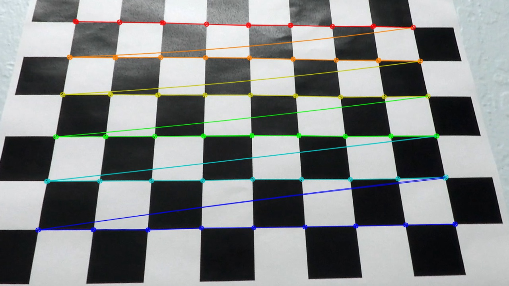
    </td>
    <td style="text-align: center;">
        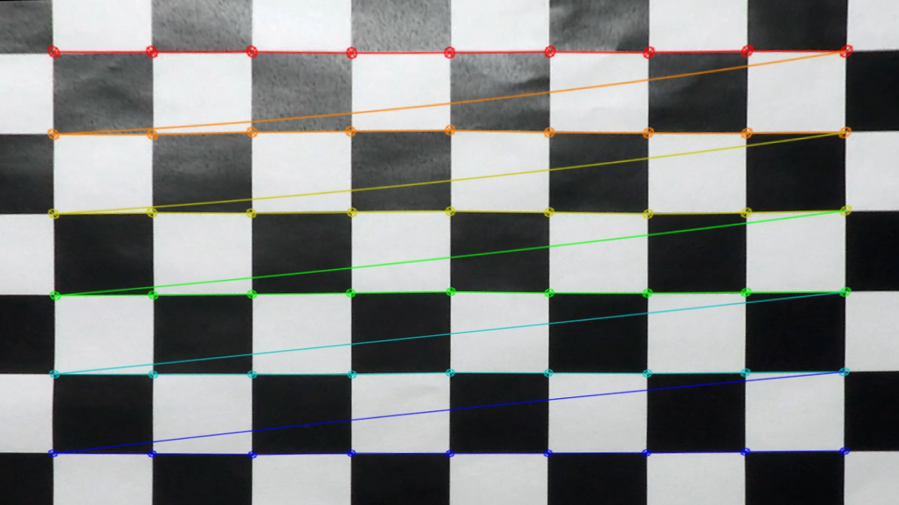
    </td>
</tr>
</table>


The video image obtained from the car camera is not a true image due to distortions and inherent lens structural properties. These inaccuracies in the image may lead to incorrect dicision making for a self driving car. Hence, it is essential to minimise these inaccuracies by correcting the distortions and correct camera calibration.

Typically, a camera is calibrated by taking a checker-board picture, finding square corners and then using image processing algorithm to correct the distortion. The `OpenCV` function `cv2.findChessboardCorners` is used to detect square corners by mapping `3D` real world `object points` to `2D` `image points`. Later, `object points` and `image points` are used to calibrate camera using  `cv2.calibrateCamera` function.

The code snippet to calibrate camera and undistort (distortion correction) an image is provided below.

```python
#%% Calibrate Car Camera
def calibrateCarCamera(img, nx, ny):
    """
	 Calibrate camera
	:param img: Image
	:param nx: Checkerboard corners in X-direction
    :param ny: Checkerboard corners in Y-direction
	:return:
	    None
        The camera matrix and distortion coefficients are pickled in a dictionary to a file.
	"""

    # prepare object points, like (0,0,0), (1,0,0), (2,0,0) ....,(6,5,0)
    objp = np.zeros((nx*ny,3), np.float32)
    objp[:,:2] = np.mgrid[0:nx, 0:ny].T.reshape(-1,2)

    # Arrays to store object points and image points from all the images.
    objpoints = [] # 3d points in real world space
    imgpoints = [] # 2d points in image plane.

    gray = cv2.cvtColor(img, cv2.COLOR_BGR2GRAY)

    # Find the chessboard corners
    ret, corners = cv2.findChessboardCorners(gray, (nx, ny), None)

    # If found, add object points, image points
    if ret == True:
        objpoints.append(objp)
        imgpoints.append(corners)

        # Draw and display the corners
        cv2.drawChessboardCorners(img, (nx,ny), corners, ret)

    # Test undistortion on an image
    img_size = (img.shape[1], img.shape[0])

    # Do camera calibration given object points and image points
    ret, mtx, dist, rvecs, tvecs = cv2.calibrateCamera(objpoints, imgpoints, img_size, None, None)

    dst = undistortImage(img, mtx, dist)

    # Save the camera calibration result for later use (we won't worry about rvecs / tvecs)
    dist_pickle = {}
    dist_pickle["mtx"] = mtx
    dist_pickle["dist"] = dist
    pickle.dump( dist_pickle, open("camera_calibration_pickle.p", "wb" ) )
    return None
```

```python
#%% Undistort image
def undistortImage(img, mtx, dist):
    """
	 Undistort image using camera matrix and distortion coefficients
	:param img: Image
	:param mtx: Camera matrix
    :param dist: camera distortion coefficients
	:return:
	    undistorted image
	"""

    return cv2.undistort(img, mtx, dist, None, mtx)
```

The following figure presents the camera calibration along within distortion correction implemented on a real-life road image. 

<table>
<tr>
    <td style="text-align: center;">
        **Original Image**
    </td>
    <td style="text-align: center;">
        **Distortion Correction**
    </td>
    <td style="text-align: center;">
        **Distortion Correction and Warped Image**
    </td>
</tr>
<tr>
    <td style="text-align: center;">
        
    </td>
    <td style="text-align: center;">
        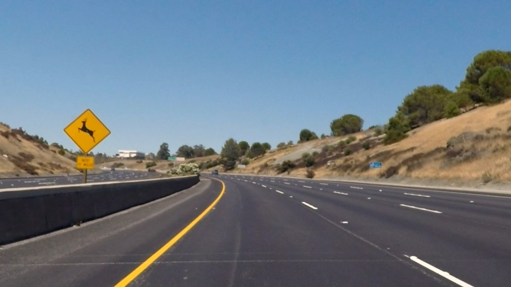
    </td>
    <td style="text-align: center;">
        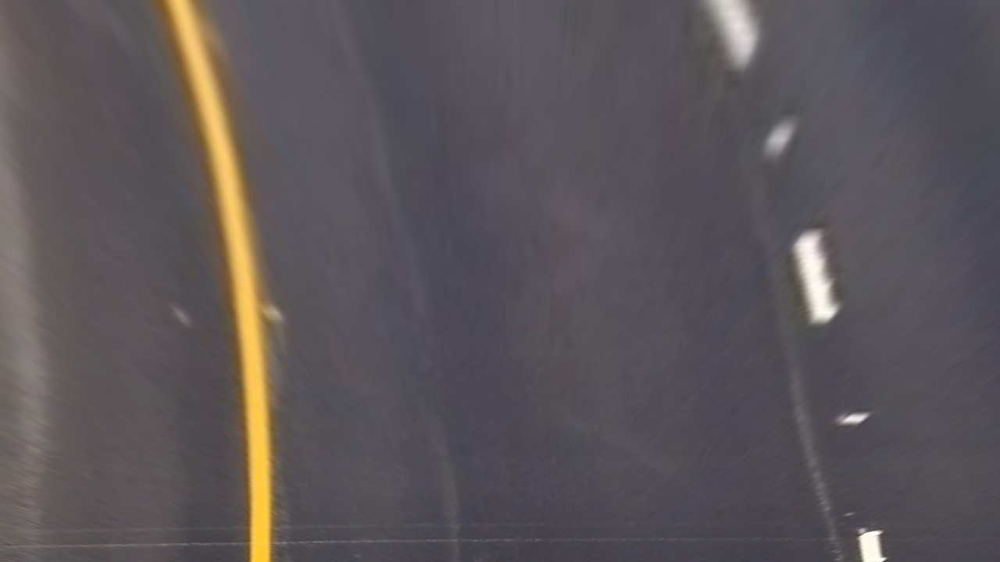
    </td>
</tr>
</table>

- - -

## 3. Lane Detection Pipeline

After the camera image is corrected, 


### 3.1 Color and Gradient Transformations
#### 3.1.1 Color Transformation

```python
#%% Select white/yellow pixels lanes

def color_pixels_hsv(img, white_color_range, yellow_color_range):
    """
	 Select white/yellow pixels lanes in HSV color space
	:param img: Image
    :param white_color_range: low/high threshold value to select white color
    :param yellow_color_range: low/high threshold value to select yellow color
	:return:
	   white/yellow pixels in image
	"""

    img = np.copy(img)

    # Convert to HSV color space and separate the V channel
    hsv = cv2.cvtColor(img, cv2.COLOR_RGB2HSV).astype(np.float)

    # Create masks for white and yellow colors
    white_mask = cv2.inRange(hsv, white_color_range[0], white_color_range[1])
    yellow_mask = cv2.inRange(hsv, yellow_color_range[0], yellow_color_range[1])

    # Select white and yellow pixels
    white_pixels = cv2.bitwise_and(hsv, hsv, mask= white_mask)
    yellow_pixels = cv2.bitwise_and(hsv, hsv, mask= yellow_mask)

    # Select white and yellow pixels in image
    pixels = cv2.bitwise_or(white_pixels,yellow_pixels)
    return pixels
```


<table>
<tr>
    <td style="text-align: center;">
        **Original Image**
    </td>
    <td style="text-align: center;">
        **White Pixels**
    </td>
</tr>
<tr>
    <td style="text-align: center;">
        
    </td>
    <td style="text-align: center;">
        
    </td>
</tr>
<tr>
    <td style="text-align: center;">
        **Yellow pixels**
    </td>
    <td style="text-align: center;">
        **White and Yellow Pixels**
    </td>
</tr>
<tr>
    <td style="text-align: center;">
        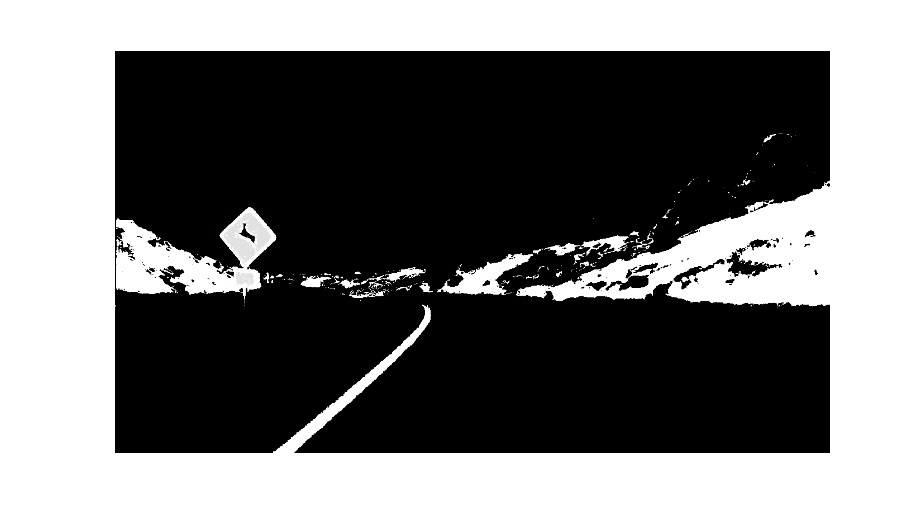
    </td>
    <td style="text-align: center;">
        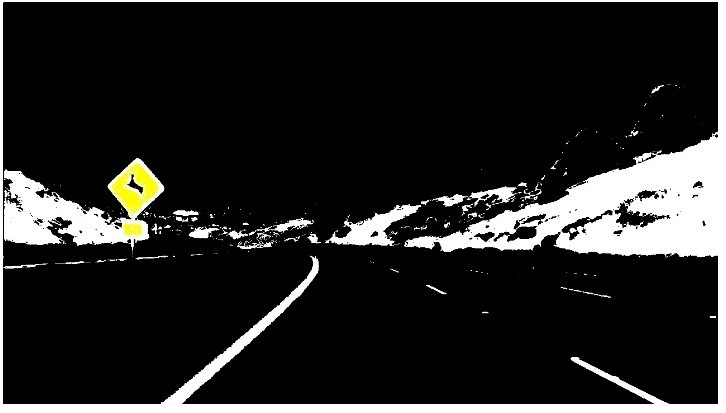
    </td>
</tr>
</table>

#### 3.1.2 Gradient Transformation

<table>
<tr>
    <td style="text-align: center;">
        **Original Image**
    </td>
    <td style="text-align: center;">
        **S-channel Threshold**
    </td>
</tr>
<tr>
    <td style="text-align: center;">
        
    </td>
    <td style="text-align: center;">
        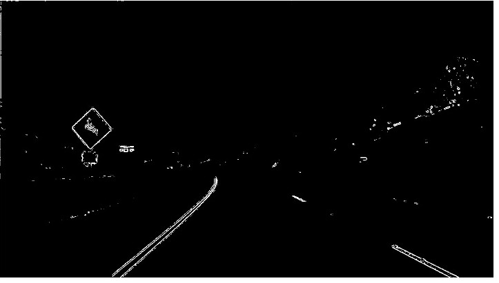
    </td>
</tr>
<tr>
    <td style="text-align: center;">
        **L-channel Threshold**
    </td>
    <td style="text-align: center;">
        **S- and L- channels Threshold**
    </td>
</tr>
<tr>
    <td style="text-align: center;">
        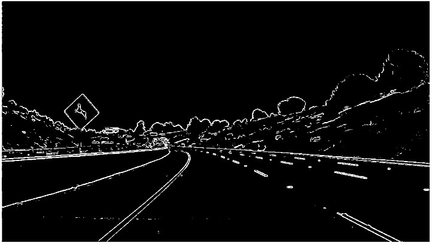
    </td>
    <td style="text-align: center;">
        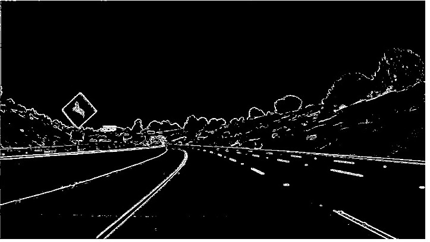
    </td>
</tr>
</table>


#### 3.1.3 Combined Color and Gradient Transformations
<table>
<tr>
    <td style="text-align: center;">
        **Original Image**
    </td>
    <td style="text-align: center;">
        **Combined Color and Gradient Transformations**
    </td>
</tr>
<tr>
    <td style="text-align: center;">
        
    </td>
    <td style="text-align: center;">
        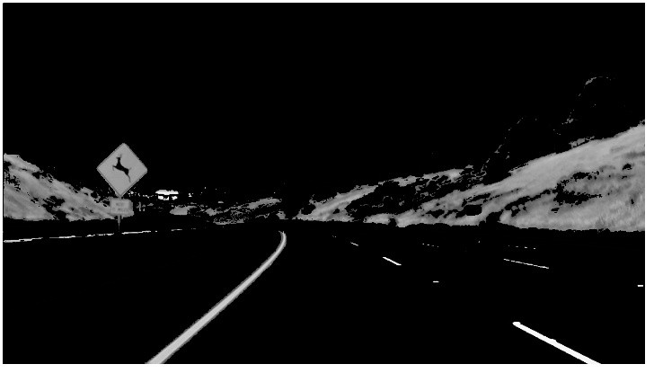
    </td>
</tr>
</table>

Use color transforms, gradients, etc., to create a thresholded binary image
### 3.2 Apply a perspective transform to rectify binary image ("birds-eye view")

<table>
<tr>
    <td style="text-align: center;">
        **Original Image**
    </td>
    <td style="text-align: center;">
        **Perspective Transformation**
    </td>
</tr>
<tr>
    <td style="text-align: center;">
        
    </td>
    <td style="text-align: center;">
        
    </td>
</tr>
</table>

### 3.3 Detect lane pixels and fit to find lane boundary

<table>
<tr>
    <td style="text-align: center;">
        **Original Image**
    </td>
    <td style="text-align: center;">
        **Lane Detection**
    </td>
    <td style="text-align: center;">
        **Lane Fit**
    </td>    
</tr>
<tr>
    <td style="text-align: center;">
        
    </td>
    <td style="text-align: center;">
        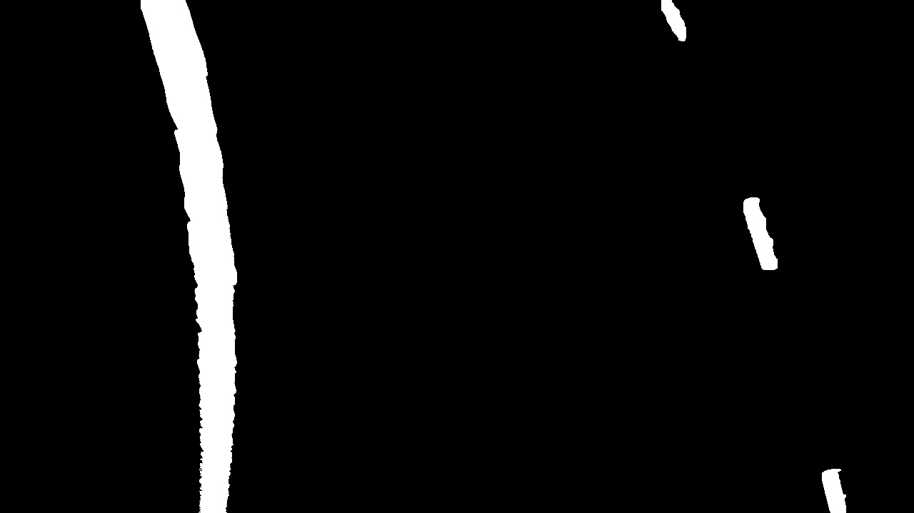
    </td>
    <td style="text-align: center;">
        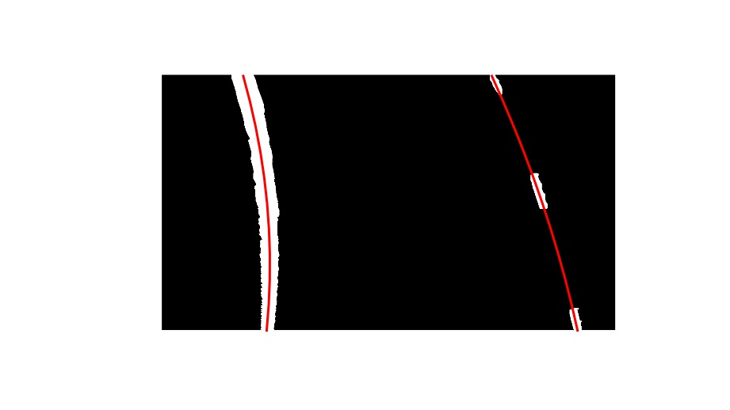
    </td>    
</tr>
</table>

- - -

## 4. Calculating Curvature of Road and Vehicle Position
### 4.1 Determine curvature of the lane and vehicle position with respect to center
### 4.2 Warp the detected lane boundaries back onto the original image


### 4.3 Output visual display of the lane boundaries and numerical estimation of lane curvature and vehicle position

<table>
<tr>
    <td style="text-align: center;">
        **Original Image**
    </td>
    <td style="text-align: center;">
        **Processed Image**
    </td>
</tr>
<tr>
    <td style="text-align: center;">
        
    </td>
    <td style="text-align: center;">
        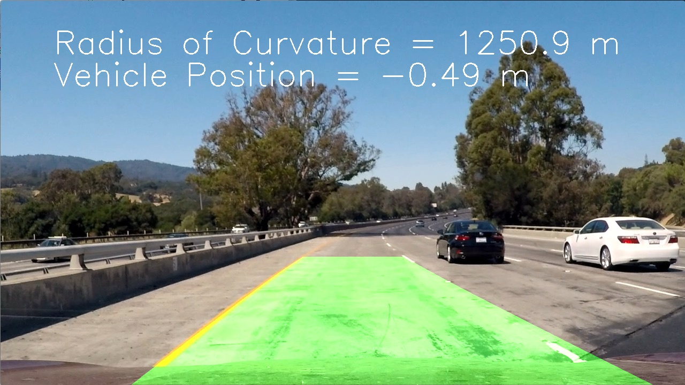
    </td>
</tr>
<tr>
    <td style="text-align: center;">
        
    </td>
    <td style="text-align: center;">
        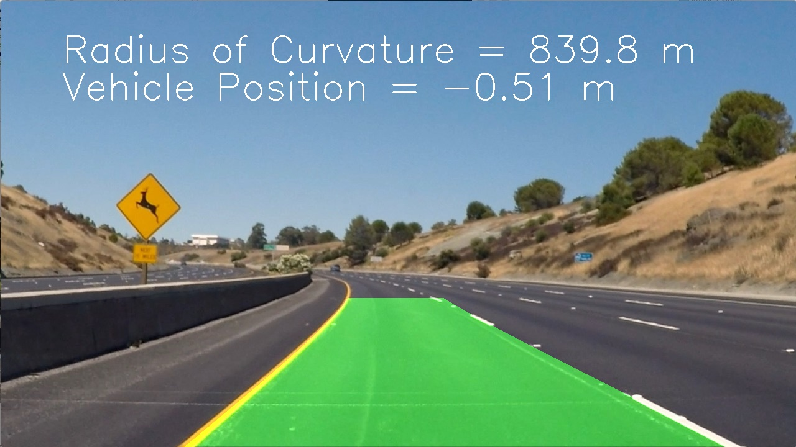
    </td>
</tr>
<tr>
    <td style="text-align: center;">
        
    </td>
    <td style="text-align: center;">
        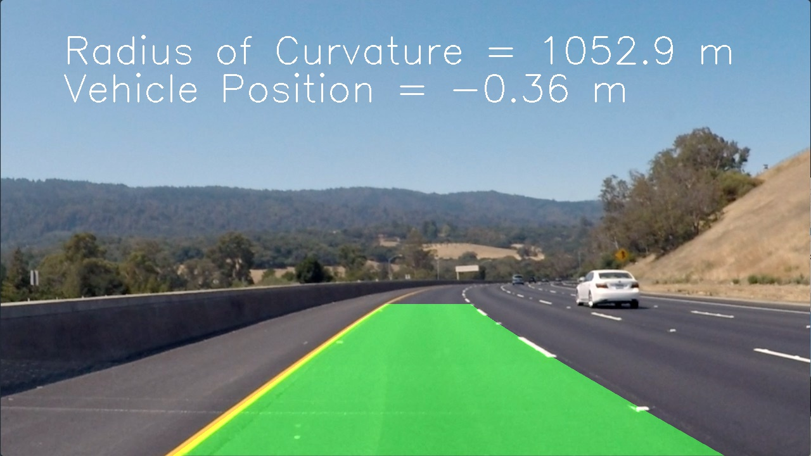
    </td>
</tr>
<tr>
    <td style="text-align: center;">
        
    </td>
    <td style="text-align: center;">
        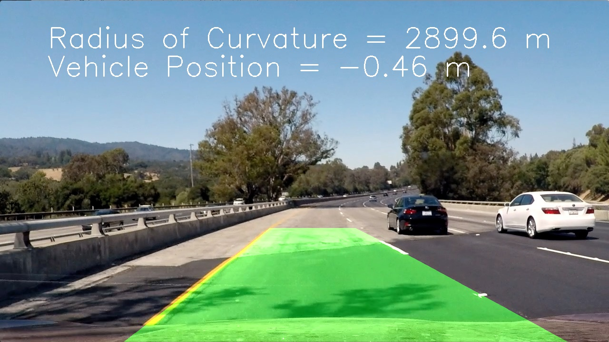
    </td>
</tr>
<tr>
    <td style="text-align: center;">
        
    </td>
    <td style="text-align: center;">
        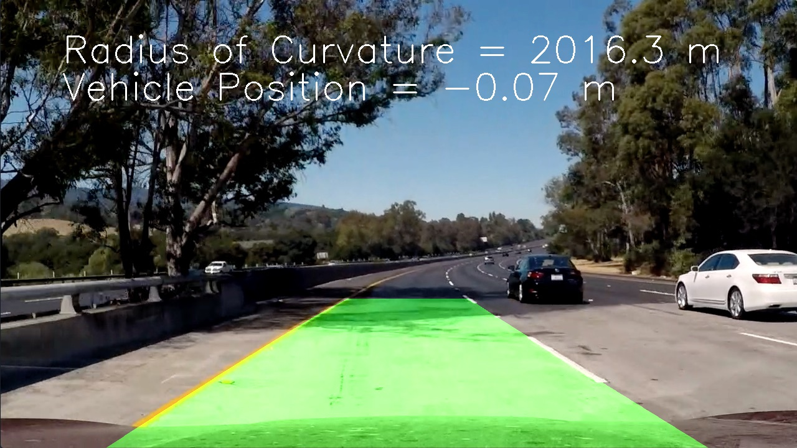
    </td>
</tr>
<tr>
    <td style="text-align: center;">
        
    </td>
    <td style="text-align: center;">
        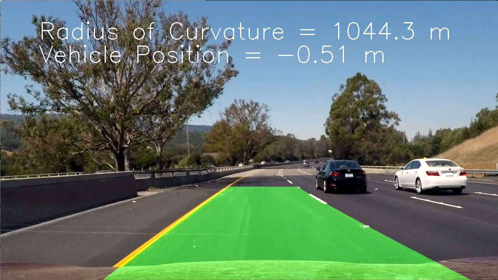
    </td>
</tr>
</table>

- - -

## 5. Video Processing Pipeline

The pipeline consists of

```
#%% Video image processing

def video_processing_pipeline(img):
    """
	 Video processing pipeline
	:param img: image
	:return:
       detected road lanes highlighted with color wrap with radius of curvature and vehicle position value
	"""

    # Global variables for smoothining data
    global runningcur
    global smoothcurvature

    # warp image
    warped = roadPerspectiveTransFormation(pfile_cb, img, hood_pixels=0)

    # Detect lanes
    lrlanes = lane_detection_pipeline(warped, pfile_cb, kernels = 5,hood_pixels=0)
    lrlanes = remove_noise(lrlanes, threshold = 0.08)
    lxlane, lylane, rxlane, rylane = detect_lanes(lrlanes, slabs)

    # Fit lines and determine curvature
    lfitx, lfity = fitlane(lrlanes, lylane, lxlane, poly, num_pts)
    rfitx, rfity = fitlane(lrlanes, rylane, rxlane, poly, num_pts)
    lcurvature = lanecurvature1(lrlanes, lfity, lfitx, poly)
    rcurvature = lanecurvature1(lrlanes, rfity, rfitx, poly)
    avgcurvature = (lcurvature+rcurvature)/2.0

    # Running average
    runningcur = np.append(runningcur,avgcurvature)
    sc = runningavg(runningcur, window_width)
    smoothcurvature = np.append(smoothcurvature,sc)

    # Smoothen the line via first-order filter
    curvature = alpha* smoothcurvature[-1] + (1-alpha)* smoothcurvature[-2]
    vposition = ( img.shape[1]/2 - (lfitx[-1]+rfitx[-1])/2)*xm_per_pix

    # Process the image
    result = plot_road(img, lrlanes, pfile_cb, lfitx, lfity, rfitx, rfity,curvature,vposition)

    return result
```


[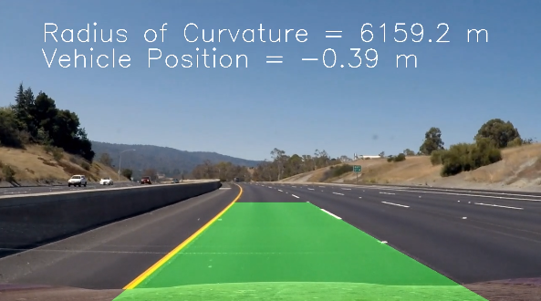](https://youtu.be/aJRmShMjjak)


- - -


## 6. Conclusions

- - -

## 7. Refelections

- - -

## References

