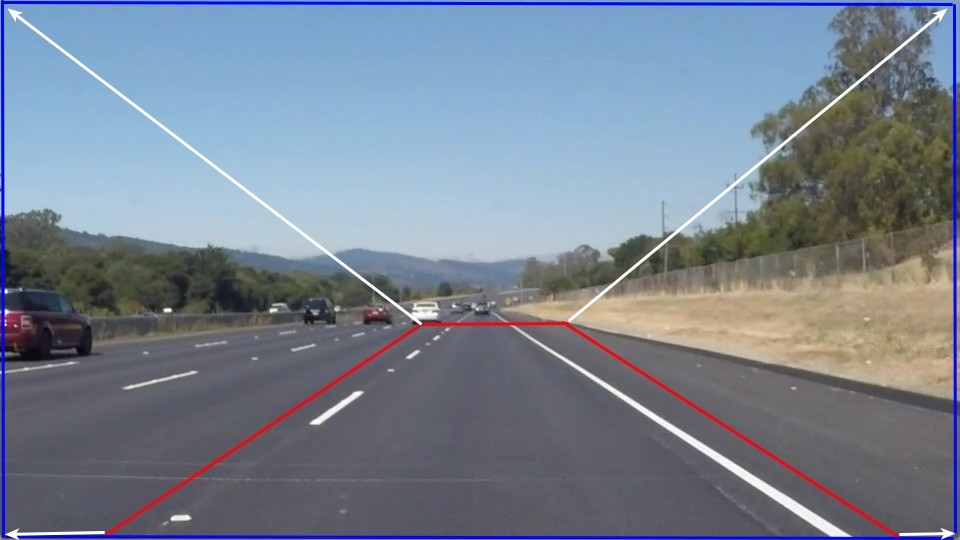
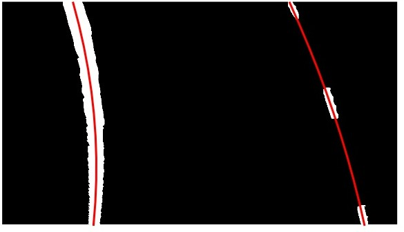

# Self-Driving Car Engineer Nanodegree

# Advanced Lane Finding
- - -
[TOC]

## 1. Project Overview

The objective of this project is to create a image/video processing pipeline to detect road lanes under different enviornmental conditions using image processing techniques. 


## 2. Camera Calibration and Distortion Correction

<table>
<tr>
    <td style="text-align: center;">
        **Original Image**
    </td>
    <td style="text-align: center;">
        **Distortion Correction**
    </td>
    <td style="text-align: center;">
        **Distortion Correction and Warped Image**
    </td>
</tr>
<tr>
    <td style="text-align: center;">
        
    </td>
    <td style="text-align: center;">
        
    </td>
    <td style="text-align: center;">
        
    </td>
</tr>
</table>


The video image obtained from the car camera is not a true image due to distortions and inherent lens structural properties. These inaccuracies in the image may lead to incorrect dicision making for a self driving car. Hence, it is essential to minimise these inaccuracies by correcting the distortions and correct camera calibration.

Typically, a camera is calibrated by taking a checker-board picture, finding square corners and then using image processing algorithm to correct the distortion. The `OpenCV` function `cv2.findChessboardCorners` is used to detect square corners by mapping `3D` real world `object points` to `2D` `image points`. Later, `object points` and `image points` are used to calibrate camera using  `cv2.calibrateCamera` function.

The code snippet to calibrate camera and undistort (distortion correction) an image is provided below.

```python
#%% Calibrate Car Camera
def calibrateCarCamera(img, nx, ny):
    """
	 Calibrate camera
	:param img: Image
	:param nx: Checkerboard corners in X-direction
    :param ny: Checkerboard corners in Y-direction
	:return:
	    None
        The camera matrix and distortion coefficients are pickled in a dictionary to a file.
	"""

    # prepare object points, like (0,0,0), (1,0,0), (2,0,0) ....,(6,5,0)
    objp = np.zeros((nx*ny,3), np.float32)
    objp[:,:2] = np.mgrid[0:nx, 0:ny].T.reshape(-1,2)

    # Arrays to store object points and image points from all the images.
    objpoints = [] # 3d points in real world space
    imgpoints = [] # 2d points in image plane.

    gray = cv2.cvtColor(img, cv2.COLOR_BGR2GRAY)

    # Find the chessboard corners
    ret, corners = cv2.findChessboardCorners(gray, (nx, ny), None)

    # If found, add object points, image points
    if ret == True:
        objpoints.append(objp)
        imgpoints.append(corners)

        # Draw and display the corners
        cv2.drawChessboardCorners(img, (nx,ny), corners, ret)

    # Test undistortion on an image
    img_size = (img.shape[1], img.shape[0])

    # Do camera calibration given object points and image points
    ret, mtx, dist, rvecs, tvecs = cv2.calibrateCamera(objpoints, imgpoints, img_size, None, None)

    dst = undistortImage(img, mtx, dist)

    # Save the camera calibration result for later use (we won't worry about rvecs / tvecs)
    dist_pickle = {}
    dist_pickle["mtx"] = mtx
    dist_pickle["dist"] = dist
    pickle.dump( dist_pickle, open("camera_calibration_pickle.p", "wb" ) )
    return None
```

```python
#%% Undistort image
def undistortImage(img, mtx, dist):
    """
	 Undistort image using camera matrix and distortion coefficients
	:param img: Image
	:param mtx: Camera matrix
    :param dist: camera distortion coefficients
	:return:
	    undistorted image
	"""

    return cv2.undistort(img, mtx, dist, None, mtx)
```

The following figure presents the camera calibration along within distortion correction implemented on a real-life road image. 

<table>
<tr>
    <td style="text-align: center;">
        **Original Image**
    </td>
    <td style="text-align: center;">
        **Distortion Correction**
    </td>
    <td style="text-align: center;">
        **Distortion Correction and Warped Image**
    </td>
</tr>
<tr>
    <td style="text-align: center;">
        
    </td>
    <td style="text-align: center;">
        
    </td>
    <td style="text-align: center;">
        
    </td>
</tr>
</table>

- - -

## 3. Lane Detection Pipeline

After the camera image is corrected, the next step is to identify lane lines. Typically, the lane lines are `white` and `yellow` in color. `Color` and `edges` are two common attributes, which can be used to detect lanes. 


### 3.1 Color Transformation

Though it is easy to detect `white` and `yellow` lane colors in day light, they become difficult to identify under night/twilight/dawn light conditions or different enviornmental conditons including rain, snow. The lane detetion algorithm  should be robust to detect road lines under various light/enviornmental conditions. Red-Green-Blue (RGB) is not a robust color space to identify road lanes. Hue-Saturation-Vibrance (HSV) can prove to a working solution to discriminate colors under various light/enviornmental conditions. Initial experimentation suggested that implementing masks of thresholed `white` and `yellow` color using the `cv2.inRange` function to extract lane pixels.

The following snippet extract `white` and `yellow` pixels from image using `white_color_range` and `yellow_color_range` threshold values. 

```python
#%% Select white/yellow pixels lanes

def color_pixels_hsv(img, white_color_range, yellow_color_range):
    """
	 Select white/yellow pixels lanes in HSV color space
	:param img: Image
    :param white_color_range: low/high threshold value to select white color
    :param yellow_color_range: low/high threshold value to select yellow color
	:return:
	   white/yellow pixels in image
	"""

    img = np.copy(img)

    # Convert to HSV color space and separate the V channel
    hsv = cv2.cvtColor(img, cv2.COLOR_RGB2HSV).astype(np.float)

    # Create masks for white and yellow colors
    white_mask = cv2.inRange(hsv, white_color_range[0], white_color_range[1])
    yellow_mask = cv2.inRange(hsv, yellow_color_range[0], yellow_color_range[1])

    # Select white and yellow pixels
    white_pixels = cv2.bitwise_and(hsv, hsv, mask= white_mask)
    yellow_pixels = cv2.bitwise_and(hsv, hsv, mask= yellow_mask)

    # Select white and yellow pixels in image
    pixels = cv2.bitwise_or(white_pixels,yellow_pixels)
    return pixels
```


<table>
<tr>
    <td style="text-align: center;">
        **Original Image**
    </td>
    <td style="text-align: center;">
        **White Pixels**
    </td>
</tr>
<tr>
    <td style="text-align: center;">
        
    </td>
    <td style="text-align: center;">
        
    </td>
</tr>
<tr>
    <td style="text-align: center;">
        **Yellow pixels**
    </td>
    <td style="text-align: center;">
        **White and Yellow Pixels**
    </td>
</tr>
<tr>
    <td style="text-align: center;">
        
    </td>
    <td style="text-align: center;">
        
    </td>
</tr>
</table>

### 3.2 Gradient Transformation

The edges can be a good indicator of road lanes. The edges/lines can be determined by edge detection algorithm. Initial experiments reveal that the Hue-Saturation-Lightness (HSL) color space can be a good choice to detect gradient under different light/enviornmental conditions. L- and S- channels are used to extract edges [[Reference]](https://medium.com/@vivek.yadav/robust-lane-finding-using-advanced-computer-vision-techniques-mid-project-update-540387e95ed3#.qc1y9h6y0). 

Sobel filters is one of the popular filter used to extract lines/edges in an image via convolution operations. The horizontal and vertical edges can be extracted using Sobel filters in X/Y directions and later combined to obtain lane lines.

The following snippet extract lines using Sobel filters. 

```python
#%% Implement thresholding pipeline to detect lanes using gradient

def thresholding_pipeline(img, kernels= 5, s_thresh=(50,225), l_thresh=(50,225)):
    """
	 Implement thresholding pipeline to detect lanes using gradient
	:param img: Image
    :param kernel: kernel size (odd number)
    :param s_thresh: low/high threshold value for `saturation` channel in HSV color space
    :param l_thresh: low/high threshold value for `light` channel in HSL color space
	:return:
	   thresholded image
	"""
    img = np.copy(img)

    # Convert to HSV color space and separate the V channel
    hls = cv2.cvtColor(img, cv2.COLOR_RGB2HLS).astype(np.float)
    l_channel = hls[:,:,1]
    s_channel = hls[:,:,2]

    ####################
    # Sobel xy - channel l
    sobx = abs_sobel_thresh1(l_channel,'x',kernels,s_thresh)
    soby = abs_sobel_thresh1(l_channel,'y',kernels,s_thresh)
    l_sobelxy = np.copy(cv2.bitwise_or(sobx,soby))

    ####################
    # Sobel xy - channel s
    sobx = abs_sobel_thresh1(s_channel,'x',kernels,s_thresh)
    soby = abs_sobel_thresh1(s_channel,'y',kernels,s_thresh)
    s_sobelxy = np.copy(cv2.bitwise_or(sobx,soby))

    ####################
    # Threshold color channel
    image = cv2.bitwise_or(l_sobelxy,s_sobelxy)
    image = gaussian_blur(image,kernels)
    return image
```

<table>
<tr>
    <td style="text-align: center;">
        **Original Image**
    </td>
    <td style="text-align: center;">
        **S-channel Threshold**
    </td>
</tr>
<tr>
    <td style="text-align: center;">
        
    </td>
    <td style="text-align: center;">
        
    </td>
</tr>
<tr>
    <td style="text-align: center;">
        **L-channel Threshold**
    </td>
    <td style="text-align: center;">
        **S- and L- channels Threshold**
    </td>
</tr>
<tr>
    <td style="text-align: center;">
        
    </td>
    <td style="text-align: center;">
        
    </td>
</tr>
</table>


### 3.3 Combined Color and Gradient Transformations

The lane detection algorithm can be made robust by combining the pixels obtained using color and gradient (edge detection) transformations. This can be achieved by using the function described below:

```python
#%% Impelement lane detection pipeline

def lane_detection_pipeline(img, pfile_cb, kernels = 5, hood_pixels=0):
    """
	 Determine camera matrix and distortion coefficients
	:param img: Image
	:param pfile_cb: Dictionary of camera/perspective matrix and distortion coefficients
    :param kernel: kernel size (odd number)
    :param hood_pixels: Number of pixels in vertical directions spanning vehicle hood
	:return:
	   detected left/right lanes in the image
	"""
    # Lane detection using gradients in the HSL space
    hslwrp = thresholding_pipeline1(img, kernels=kernels, s_thresh=s_thresh, l_thresh=l_thresh)
    # lane detection using color thresholding in HSV space
    hsv = color_pixels_hsv(img, white_color_rangehsv, yellow_color_rangehsv)

    # combined hsv + hsl
    hsvgray = cv2.cvtColor(hsv.astype(np.uint8), cv2.COLOR_HSV2RGB)
    hsvgray = cv2.cvtColor(hsvgray, cv2.COLOR_RGB2GRAY)

    # lane detection using combined color and gradient
    lrlanes = np.copy(cv2.bitwise_or(hslwrp,hsvgray))

    # Thresholding image
    _, lrlanes = cv2.threshold(lrlanes,1,255,cv2.THRESH_BINARY)
    return lrlanes
```language
```

<table>
<tr>
    <td style="text-align: center;">
        **Original Image**
    </td>
    <td style="text-align: center;">
        **Combined Color and Gradient Transformations**
    </td>
</tr>
<tr>
    <td style="text-align: center;">
        
    </td>
    <td style="text-align: center;">
        
    </td>
</tr>
</table>

### 3.4 Apply a perspective transform to rectify binary image ("birds-eye view")

Next, the detected lanes needs to be transformed by perspective transformation to birds-eye view for line fitting and curvature calculations. The perspective transformation is conducted by mapping the source points (envelope of detected lanes) and destination points. The mapping of source points (intersection of red lines) and destination points (intersection of blue lines) is presented in the following figure.

|Source  | Destination |
| ------------- |:-------------:|
| (0, 690) | (0 , 720)|
| (1280, 690) | (1280, 720)|
| (768, 480) | (1280, 0)|
| (512, 480) | (0 , 0)|

<table>
<tr>
    <td style="text-align: center;">
        
    </td>
</tr>
</table>

<table>
<tr>
    <td style="text-align: center;">
        **Original Image**
    </td>
    <td style="text-align: center;">
        **Perspective Transformation**
    </td>
</tr>
<tr>
    <td style="text-align: center;">
        
    </td>
    <td style="text-align: center;">
        
    </td>
</tr>
</table>

### 3.5 Detect lane pixels and fit to find lane boundary

<table>
<tr>
    <td style="text-align: center;">
        **Original Image**
    </td>
    <td style="text-align: center;">
        **Lane Detection**
    </td>
    <td style="text-align: center;">
        **Lane Fit**
    </td>    
</tr>
<tr>
    <td style="text-align: center;">
        
    </td>
    <td style="text-align: center;">
        
    </td>
    <td style="text-align: center;">
        
    </td>    
</tr>
</table>

- - -

## 4. Calculating Curvature of Road and Vehicle Position
### 4.1 Determine curvature of the lane and vehicle position with respect to center
### 4.2 Warp the detected lane boundaries back onto the original image


### 4.3 Output visual display of the lane boundaries and numerical estimation of lane curvature and vehicle position

<table>
<tr>
    <td style="text-align: center;">
        **Original Image**
    </td>
    <td style="text-align: center;">
        **Processed Image**
    </td>
</tr>
<tr>
    <td style="text-align: center;">
        
    </td>
    <td style="text-align: center;">
        
    </td>
</tr>
<tr>
    <td style="text-align: center;">
        
    </td>
    <td style="text-align: center;">
        
    </td>
</tr>
<tr>
    <td style="text-align: center;">
        
    </td>
    <td style="text-align: center;">
        
    </td>
</tr>
<tr>
    <td style="text-align: center;">
        
    </td>
    <td style="text-align: center;">
        
    </td>
</tr>
<tr>
    <td style="text-align: center;">
        
    </td>
    <td style="text-align: center;">
        
    </td>
</tr>
<tr>
    <td style="text-align: center;">
        
    </td>
    <td style="text-align: center;">
        
    </td>
</tr>
</table>

- - -

## 5. Video Processing Pipeline

The pipeline consists of

```
#%% Video image processing

def video_processing_pipeline(img):
    """
	 Video processing pipeline
	:param img: image
	:return:
       detected road lanes highlighted with color wrap with radius of curvature and vehicle position value
	"""

    # Global variables for smoothining data
    global runningcur
    global smoothcurvature

    # warp image
    warped = roadPerspectiveTransFormation(pfile_cb, img, hood_pixels=0)

    # Detect lanes
    lrlanes = lane_detection_pipeline(warped, pfile_cb, kernels = 5,hood_pixels=0)
    lrlanes = remove_noise(lrlanes, threshold = 0.08)
    lxlane, lylane, rxlane, rylane = detect_lanes(lrlanes, slabs)

    # Fit lines and determine curvature
    lfitx, lfity = fitlane(lrlanes, lylane, lxlane, poly, num_pts)
    rfitx, rfity = fitlane(lrlanes, rylane, rxlane, poly, num_pts)
    lcurvature = lanecurvature1(lrlanes, lfity, lfitx, poly)
    rcurvature = lanecurvature1(lrlanes, rfity, rfitx, poly)
    avgcurvature = (lcurvature+rcurvature)/2.0

    # Running average
    runningcur = np.append(runningcur,avgcurvature)
    sc = runningavg(runningcur, window_width)
    smoothcurvature = np.append(smoothcurvature,sc)

    # Smoothen the line via first-order filter
    curvature = alpha* smoothcurvature[-1] + (1-alpha)* smoothcurvature[-2]
    vposition = ( img.shape[1]/2 - (lfitx[-1]+rfitx[-1])/2)*xm_per_pix

    # Process the image
    result = plot_road(img, lrlanes, pfile_cb, lfitx, lfity, rfitx, rfity,curvature,vposition)

    return result
```


[](https://youtu.be/aJRmShMjjak)


- - -


## 6. Conclusions

- - -

## 7. Refelections

- - -

## References

