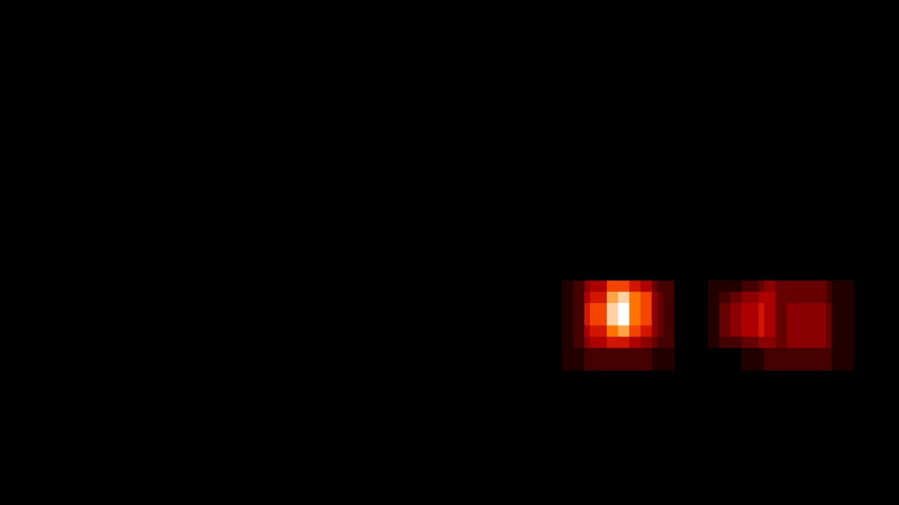

# Self-Driving Car Engineer Nanodegree 
# Vehicle Detection and Tracking
- - - 
[TOC] 
## 1. Project Overview 
The objective of this project is to create a image/video processing pipeline to detect vehicles and track them using using traditional image processing techniques. 

A `vehicle` and `non-vehicle` data is read. Sample images of `64x64` pixels are plotted below.

<table> 
<tr> 
<td style="text-align: center;"> 
**Sample Vehicle Images** 
</td> 
<td style="text-align: center;"> 
**Sample Non-Vehicle Images** 
</td> 
</tr> 
<tr> 
<td style="text-align: center;"> 
 
</td> 
<td style="text-align: center;"> 
 
</td> 
</tr> 
</table> 

## 2. Feature Extraction
To detect and track vehicles, edges, shape, color and size  are used as characterizing features. In this section, we dive in details of how to use these features in training the model for detection and tracking.

### 2.1 Histogram of Oriented Gradients (HOG)

### 2.2 Spatial Features

### 2.3 Histogram Features

## 3. Training a Classifier

## 4. Sliding Window Search

## 5. Image Processing Pipeline
<table> 
<tr> 
<td style="text-align: center;"> 
**Original Image** 
</td> 
<td style="text-align: center;"> 
**HeatMap** 
</td> 
<td style="text-align: center;"> 
**Vehicle Detection** 
</td> 
</tr> 
<tr> 
<td style="text-align: center;"> 
 
</td> 
<td style="text-align: center;"> 
 
</td> 
<td style="text-align: center;"> 
 
</td>
<tr> 
<td style="text-align: center;"> 
 
</td> 
<td style="text-align: center;"> 
 
</td> 
<td style="text-align: center;"> 
 
</td> 
</tr> 
<tr> 
<td style="text-align: center;"> 
 
</td> 
<td style="text-align: center;"> 
 
</td> 
<td style="text-align: center;"> 
 
</td> 
</tr> 
<tr> 
<td style="text-align: center;"> 
 
</td> 
<td style="text-align: center;"> 
 
</td> 
<td style="text-align: center;"> 
 
</td> 
</tr> 
<tr> 
<td style="text-align: center;"> 
 
</td> 
<td style="text-align: center;"> 
 
</td> 
<td style="text-align: center;"> 
 
</td> 
</tr> 
<tr> 
<td style="text-align: center;"> 
 
</td> 
<td style="text-align: center;"> 
 
</td> 
<td style="text-align: center;"> 
 
</td> 
</tr> 
</table> 

## 6. Video Processing Pipeline

- - -

## References
* [Radius of Curvature](http://www.intmath.com/applications-differentiation/8-radius-curvature.php)
