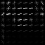
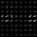
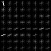
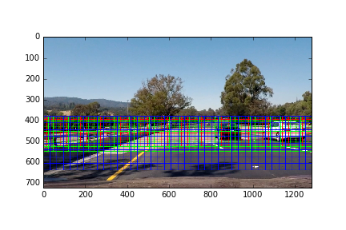
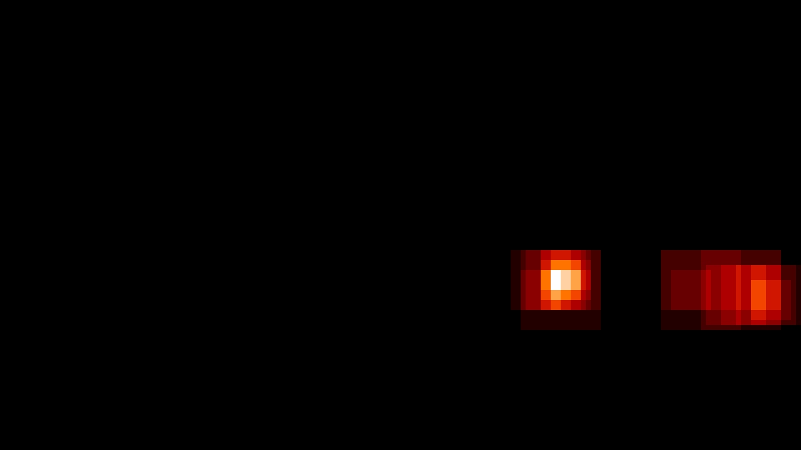

# Self-Driving Car Engineer Nanodegree 
# Vehicle Detection and Tracking
- - - 
[TOC] 
## 1. Project Overview 
The objective of this project is to create a image/video processing pipeline to detect vehicles and track them using using traditional image processing techniques. 

A `vehicle` and `non-vehicle` data is read. The dataset consists of 8792 and 8968 `vehicle` and `non-vehicle` images of size `64x64` pixels. Sample images of both the data set are plotted below. 

<table> 
<tr> 
<td style="text-align: center;"> 
**Sample Vehicle Images** 
</td>  
<td style="text-align: center;"> 
**Sample Non-Vehicle Images** 
</td> 
</tr> 
<tr> 
<td style="text-align: center;"> 
 
 
 
</td> 
<td style="text-align: center;"> 
 
 
 
</td> 
</tr> 
</table> 

## 2. Feature Extraction
To detect and track vehicles, edges, shape, color and size  are used as characterizing features. In this section, we dive in details of how to use these features in training the model for detection and tracking.  

While extracting features, I experimented with `RGB`, `HSV`, `HLS` and `YCrCb` color spaces and fit the classifier and tested it on the test images. The `YCrCb` color space perfomed best among others, and used for further analysis. 

### 2.1 Histogram of Oriented Gradients (HOG)  

HOG is a commonly used feature to detect objects in computer vision and image processing. The hog features are obtained using `get_hog_features` function in the `P5_utility_functions`. The SkLearn's `hog()` function with parameters `orientation`, `pixels_per_cell` and `cells_per_block` is used to obtain hog feature vector. On experimenting with different values of the above parameters, I finally setteled with   
`orientation` = 9,   
`pixels_per_cell` = (8,8) and   
`cells_per_block` = (2,2). 

The HOG features for sample `vehicle` and `not-vehicle` images are presented for `YCrCb` channels in the following figure separately. The HOG features for `vehicle` is well defined with horizontal and vertical edges for the `Y` channel than other two. The HOG features for `not-vehicle` image is unstructured in all the three channels. 

==HOG features for all the `Y`, `Cr` and `Cb` channels are appended in the feature vector before training the classifier.==

<table> 
<tr> 
<td style="text-align: center;">  
</td> 
<td style="text-align: center;"> 
**Original** 
</td> 
<td style="text-align: center;"> 
**Y** 
</td> 
<td style="text-align: center;"> 
**Cr** 
</td> 
<td style="text-align: center;"> 
**Cb** 
</td> 
</tr> 
<tr> 
<td style="text-align: center;"> 
Vehicle
</td> 
<td style="text-align: center;"> 
 
</td> 
<td style="text-align: center;"> 
 
</td> 
<td style="text-align: center;"> 
 
</td> 
<td style="text-align: center;"> 
 
</td> 
</tr> 
<tr> 
<td style="text-align: center;"> 
Not-Vehicle
</td> 
<td style="text-align: center;"> 
 
</td> 
<td style="text-align: center;"> 
 
</td> 
<td style="text-align: center;"> 
 
</td> 
<td style="text-align: center;"> 
 
</td> 
</tr> 
</table> 

### 2.2 Spatial Features
The spatial features are obtained using `bin_spatial` function in the `P5_utility_functions`. The `spatial_bins` = (16, 16) is used to obtain feature vector.

### 2.3 Histogram Features
The histogram features are obtained using `color_hist` function in the `P5_utility_functions`. The `hist_bins` = 16 is used to obtain feature vector.  

==The HOG, spatial and histogram features are appended together before feeding it to the classfier. ==

## 3. Training a Classifier

### 3.1 Feature Normalization
The features vector consisting of HOG, spatial and histogram features have different scales in their feature space. In order to aid numerical stability and faster convergence, the features are normalized using SkLearn's `StandardScaler` object. The normalization standardize features by removing the mean and scaling to unit variance. This is implemented in `data_train_test_split` function in the code. 

### 3.2 Training-Test Data
The training and test data is generated by random shuffling and spliting the training:test dataset in 0.75:0.25 ratio. This is implemented in `data_train_test_split` function in the code. 

### 3.3 Training Classifier and Measure Performance
SkLearn's support-vector `LinearSVC` classifer is used to train the model for its simplicity. In particular, I experimented with `C` parameter of the classfier, which penalizes misclassification. I finally setteled with `C` = 0.01 for the model training.   

On fitting the classifer, the classifer accuracy is ~99.2%. This indicates that the classifer does a good job in classifying `vehicle` and `non-vehicle` distinction. The trained classifier is saved in a pickle file for later use.  

This is implemented in `data_train_test_split` function in the code. 

## 4. Sliding Window Search

The classifier is trained on `64x64` pixels image of `vehicle` and `not-vehicle` images. The camera mounted on the hood streams video of `1280x720` pixels image with various elements such as sky, enviornment, road, vehicles, etc. In order to utilize the trained classifer to detect vehicles, the image need to split in small windows and later scaled to `64x64` pixels for prediction. This can be achieved by the sliding window technique. 

The following figure presents the sliding windows used for the project. The image above the horizon is not processed as it contain no useful information. Sliding windows of different sizes are utilized in order to make robust vehicle detection due to its near-far location on the road. The sliding window of size `64x64` (red boxes), `96x96` (green boxes) and `128x128` pixels (blue boxes) are used. The later two windows are resized to `64x64` pixels using `cv2.resize` function in order to utilize the classifier. Experiments are conducted with overlapping windows with 0.5 and 0.75, with later giving better performance. 

This is implemented in `process_pipeline` function in code. 

 

## 5. Image Processing Pipeline

Using the sliding window technique, the classifer predicts whether the window contains vehicle or not. If the vehicle is detected, the heatmap technique is used to remove false positives. The technique works as follows:   

(i) Define heatmap with `0` valued pixels.   
(ii) If the vehicle is detected, increment value of pixels in the cell by `1`    
(iii) Loop step (ii) for all the windows and threshold pixels above certain value  
(iv) Use `cipy.ndimage.measurements.label` function to define cluster in heatmap to be labeled as possible vehicle  
(v) Find vehicle bounding box coutour using `cv2.findContours` funtion  
(vi) Plot the detected vehicle.  
This is implemented in `process_pipeline` function in code. 

The following images present heatmap and detected vehicles in the test images.

<table> 
<tr> 
<td style="text-align: center;"> 
**Original Image** 
</td> 
<td style="text-align: center;"> 
**HeatMap** 
</td> 
<td style="text-align: center;"> 
**Vehicle Detection** 
</td> 
</tr> 
<tr> 
<td style="text-align: center;"> 
 
</td> 
<td style="text-align: center;"> 
 
</td> 
<td style="text-align: center;"> 
 
</td>
<tr> 
<td style="text-align: center;"> 
 
</td> 
<td style="text-align: center;"> 
 
</td> 
<td style="text-align: center;"> 
 
</td> 
</tr> 
<tr> 
<td style="text-align: center;"> 
 
</td> 
<td style="text-align: center;"> 
 
</td> 
<td style="text-align: center;"> 
 
</td> 
</tr> 
<tr> 
<td style="text-align: center;"> 
 
</td> 
<td style="text-align: center;"> 
 
</td> 
<td style="text-align: center;"> 
 
</td> 
</tr> 
<tr> 
<td style="text-align: center;"> 
 
</td> 
<td style="text-align: center;"> 
 
</td> 
<td style="text-align: center;"> 
 
</td> 
</tr> 
<tr> 
<td style="text-align: center;"> 
 
</td> 
<td style="text-align: center;"> 
 
</td> 
<td style="text-align: center;"> 
 
</td> 
</tr> 
</table> 

## 6. Video Processing Pipeline

In order to process a video, the image processing pipeline developed in the earlier section is utilized. 

Click on the image to run the video.  

- - -

## References
* [Radius of Curvature](http://www.intmath.com/applications-differentiation/8-radius-curvature.php)
