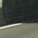
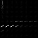
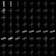
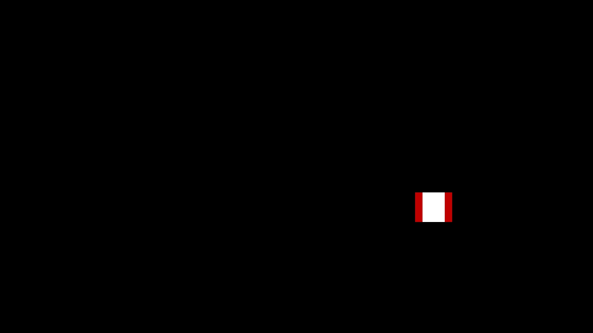

# Self-Driving Car Engineer Nanodegree 
# Vehicle Detection and Tracking
- - - 
[TOC] 
## 1. Project Overview 
The objective of this project is to create a image/video processing pipeline to detect vehicles and track them using using traditional image processing techniques. 

A `vehicle` and `non-vehicle` data is read. The dataset consists of 8792 and 8968 `vehicle` and `non-vehicle` images of size `64x64` pixels. Sample images of both the data set are plotted below. 

<table> 
<tr> 
<td style="text-align: center;"> 
**Sample Vehicle Images** 
</td> 
<td style="text-align: center;"> 
**Sample Non-Vehicle Images** 
</td> 
</tr> 
<tr> 
<td style="text-align: center;"> 
 
 
 
</td> 
<td style="text-align: center;"> 
 
 
 
</td> 
</tr> 
</table> 

## 2. Feature Extraction
To detect and track vehicles, edges, shape, color and size  are used as characterizing features. In this section, we dive in details of how to use these features in training the model for detection and tracking.  

While extracting features, I experimented with `RGB`, `HSV`, `HLS` and `YCrCb` color spaces and fit the classifier and tested it on the test images. The `YCrCb` color space perfomed best among others, and used for further analysis. 

### 2.1 Histogram of Oriented Gradients (HOG)  

HOG is a commonly used feature to detect objects in computer vision and image processing. The hog features are obtained using `get_hog_features` function in the `P5_utility_functions`. The SkLearn's `hog()` function with parameters `orientation`, `pixels_per_cell` and `cells_per_block` is used to obtain hog feature vector. On experimenting with different values of the above parameters, I finally setteled with   
`orientation` = 9,   
`pixels_per_cell` = (8,8) and   
`cells_per_block` = (2,2). 

The HOG features for sample `vehicle` and `not-vehicle` images are presented for `YCrCb` channels in the following figure separately. In the analysis, HOG features for all the channels are appended in the feature vector. 

<table> 
<tr> 
<td style="text-align: center;"> 
**Original** 
</td> 
<td style="text-align: center;"> 
**Y** 
</td> 
<td style="text-align: center;"> 
**Cr** 
</td> 
<td style="text-align: center;"> 
**Cb** 
</td> 
</tr> 
<tr> 
<td style="text-align: center;"> 
 
</td> 
<td style="text-align: center;"> 
 
</td> 
<td style="text-align: center;"> 
 
</td> 
<td style="text-align: center;"> 
 
</td> 
</tr> 
<tr> 
<td style="text-align: center;"> 
 
</td> 
<td style="text-align: center;"> 
 
</td> 
<td style="text-align: center;"> 
 
</td> 
<td style="text-align: center;"> 
 
</td> 
</tr> 
</table> 

### 2.2 Spatial Features

### 2.3 Histogram Features

## 3. Training a Classifier

## 4. Sliding Window Search

## 5. Image Processing Pipeline
<table> 
<tr> 
<td style="text-align: center;"> 
**Original Image** 
</td> 
<td style="text-align: center;"> 
**HeatMap** 
</td> 
<td style="text-align: center;"> 
**Vehicle Detection** 
</td> 
</tr> 
<tr> 
<td style="text-align: center;"> 
 
</td> 
<td style="text-align: center;"> 
 
</td> 
<td style="text-align: center;"> 
 
</td>
<tr> 
<td style="text-align: center;"> 
 
</td> 
<td style="text-align: center;"> 
 
</td> 
<td style="text-align: center;"> 
 
</td> 
</tr> 
<tr> 
<td style="text-align: center;"> 
 
</td> 
<td style="text-align: center;"> 
 
</td> 
<td style="text-align: center;"> 
 
</td> 
</tr> 
<tr> 
<td style="text-align: center;"> 
 
</td> 
<td style="text-align: center;"> 
 
</td> 
<td style="text-align: center;"> 
 
</td> 
</tr> 
<tr> 
<td style="text-align: center;"> 
 
</td> 
<td style="text-align: center;"> 
 
</td> 
<td style="text-align: center;"> 
 
</td> 
</tr> 
<tr> 
<td style="text-align: center;"> 
 
</td> 
<td style="text-align: center;"> 
 
</td> 
<td style="text-align: center;"> 
 
</td> 
</tr> 
</table> 

## 6. Video Processing Pipeline

- - -

## References
* [Radius of Curvature](http://www.intmath.com/applications-differentiation/8-radius-curvature.php)
