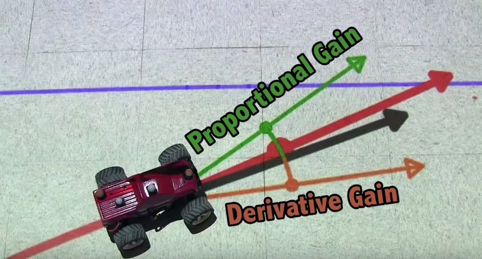
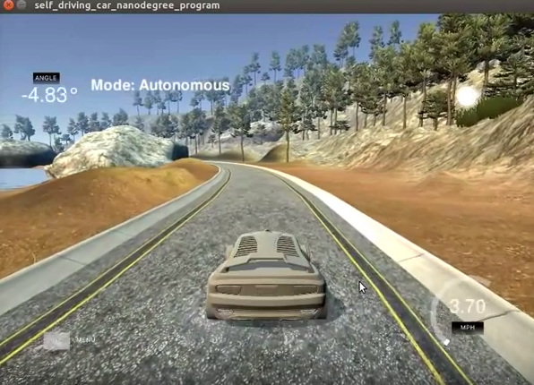

# Self-Driving Car Engineer Nanodegree 
# PID Controller 
- - - 

## 1. Project Overview   
The objective of this project is to control a self-driving car autonomously via proportional-integral-derivative (PID) controller around a simulator lake course. 

## 2. PID Controller   
A PID controller continuously calculates an error value `e(t)` as the difference between a desired set point and a measured process variable and applies a correction based on proportional, integral, and derivative terms [1,2].  

<td style="text-align: center;"> 
 
</td> 

* Proportional Control: A proportional control steers the vehicle towards the center of the track by reducing the cross-track error. The control leads to oscillating moment of a vehicle to the center of track.   
* Derivative Control: A derivative control steers a vehicle towards the centre of the track by a rate of change of cross-track error. This component stabilizes the car by reducing the oscillations caused by the proportional control.   
* Integral Control: An integral control reduces a constant error caused by drift or sharp curve. An integral term keeps tracks of error over time and tries to minimize it.  

## 3. Setting up PID hyper parameters   

The hyper parameters are set via manual tuning as follows: 
1. The hyper parameters are initialized as Kp = Ki = Kd = 0.   
2. The value of Kp is incremented in steps of 0.1. As the car moves relatively straight, the Kp is set to 0.2. 
3. Keeping Kp constant, the Kd is incremented in steps of 0.1. As the tangent hyperbolic smoothing is used for steering angle, the Kd is set to -1.75. 
4. Keeping Kp and Kd constant, the Ki is set to a smaller value of 0.001.   

The final parameters used in the project are: 
Kp = 0.2, Ki = 0.001, Kd = -1.75. 

   
Click the above image to start a video. 

## Basic Build Instructions 
1. Clone this repo. 
2. Make a build directory:  `mkdir build && cd build` 
3. Compile:  `cmake .. && make` 
4. Run it:  `./pid`. 

## References 
1 [PID Controller - Wikipedia](https://en.wikipedia.org/wiki/PID_controller) 
2 [Controlling Self-Driving  Cars - Youtube](https://www.youtube.com/watch?v=4Y7zG48uHRo) 
 